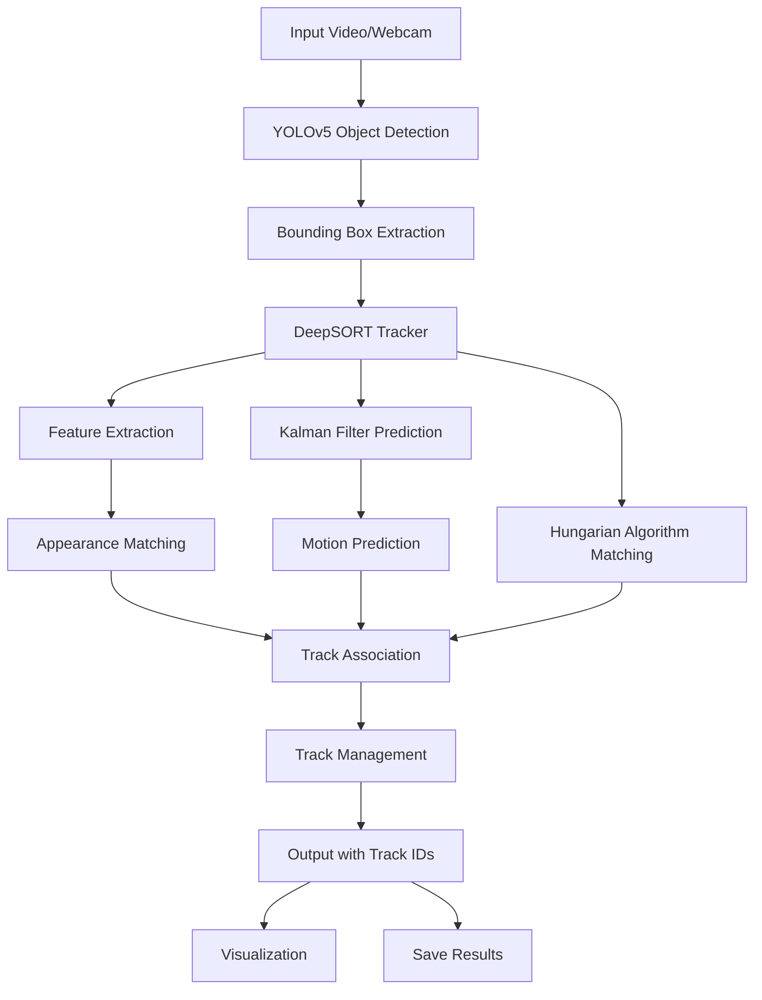
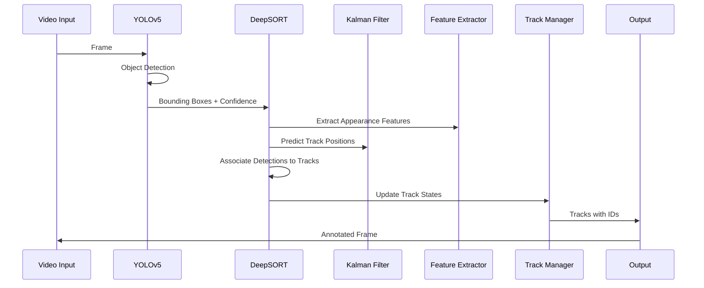

# Object Tracking with YOLOv5 and DeepSORT

A real-time multi-object tracking system that combines **YOLOv5** for object detection and **DeepSORT** for robust tracking. This implementation provides accurate object detection and tracking capabilities for video analysis applications.


## 🎯 Project Overview

This project implements a complete object tracking pipeline that can:
- Detect objects in real-time using YOLOv5
- Track multiple objects across video frames using DeepSORT
- Maintain object identities even during occlusions
- Process live webcam feeds or video files
- Export tracking results in MOT (Multiple Object Tracking) format

## 🏗️ System Architecture



## 🔧 Technical Components

### 1. YOLOv5 Detection Engine
- **Purpose**: Real-time object detection
- **Models Supported**: YOLOv5s, YOLOv5m, YOLOv5l, YOLOv5x
- **Features**:
  - Fast inference (>100 FPS on GPU)
  - High accuracy object detection
  - Support for 80 COCO classes
  - Configurable confidence thresholds

### 2. DeepSORT Tracking Algorithm
- **Purpose**: Multi-object tracking with identity preservation
- **Components**:
  - **Kalman Filter**: Motion prediction and state estimation
  - **CNN Feature Extractor**: Appearance-based re-identification
  - **Hungarian Algorithm**: Optimal assignment between detections and tracks
  - **Track Management**: Creation, update, and deletion of tracks

### 3. Key Technologies

| Technology | Purpose | Version |
|------------|---------|---------|
| **PyTorch** | Deep Learning Framework | Latest |
| **OpenCV** | Computer Vision Operations | 4.x |
| **NumPy** | Numerical Computing | Latest |
| **SciPy** | Scientific Computing | Latest |
| **EasyDict** | Configuration Management | Latest |
| **YAML** | Configuration Files | Latest |

## 📊 Processing Pipeline



## 🚀 Installation

### Prerequisites
```bash
# Python 3.7 or higher
python --version

# CUDA (optional, for GPU acceleration)
nvidia-smi
```

### Step 1: Clone Repository
```bash
git clone https://github.com/your-repo/Object-Tracking-PyTorch-YOLOv5-DeepSort.git
cd Object-Tracking-PyTorch-YOLOv5-DeepSort
```

### Step 2: Install Dependencies
```bash
# Install YOLOv5 requirements
pip install -r yolov5/requirements.txt

# Install additional requirements
pip install easydict

# For CPU-only installation
conda install pytorch==1.7.0 torchvision==0.8.0 torchaudio==0.7.0 cpuonly -c pytorch
```

### Step 3: Download Model Weights
```bash
# Download YOLOv5 weights (will auto-download on first run)
# Download DeepSORT weights
mkdir -p deep_sort_pytorch/deep_sort/deep/checkpoint
# Download ckpt.t7 from: https://drive.google.com/drive/folders/1xhG0kRH1EX5B9_Iz8gQJb7UNnn_riXi6
```

## 📖 Usage

### Basic Tracking
```bash
# Track objects in a video file
python detect_sort.py --weights yolov5s.pt --img 640 --source pedestrian.mp4

# Track objects from webcam
python detect_sort.py --weights yolov5s.pt --img 640 --source 0

# Track specific classes only (person = class 0)
python detect_sort.py --weights yolov5s.pt --img 640 --source video.mp4 --classes 0
```

### Advanced Configuration
```bash
# High confidence tracking
python detect_sort.py --weights yolov5s.pt --img 640 --source video.mp4 --conf-thres 0.7

# Save tracking results
python detect_sort.py --weights yolov5s.pt --img 640 --source video.mp4 --save-txt

# Real-time display
python detect_sort.py --weights yolov5s.pt --img 640 --source 0 --view-img
```

## ⚙️ Configuration

### DeepSORT Parameters (`deep_sort_pytorch/configs/deep_sort.yaml`)
```yaml
DEEPSORT:
  REID_CKPT: "deep_sort_pytorch/deep_sort/deep/checkpoint/ckpt.t7"
  MAX_DIST: 0.2          # Maximum cosine distance
  MIN_CONFIDENCE: 0.3    # Minimum detection confidence
  NMS_MAX_OVERLAP: 0.5   # Non-maximum suppression threshold
  MAX_IOU_DISTANCE: 0.7  # Maximum IoU distance for matching
  MAX_AGE: 70            # Maximum frames to keep lost tracks
  N_INIT: 3              # Frames to confirm track
  NN_BUDGET: 100         # Maximum appearance features per track
```

### Detection Parameters
| Parameter | Description | Default |
|-----------|-------------|---------|
| `--conf-thres` | Object confidence threshold | 0.60 |
| `--iou-thres` | NMS IoU threshold | 0.45 |
| `--max-det` | Maximum detections per image | 1000 |
| `--imgsz` | Inference image size | 640 |

## 📁 Project Structure

```
Object-Tracking-PyTorch-YOLOv5-DeepSort/
├── detect_sort.py              # Main tracking script
├── graphs.py                   # Visualization utilities
├── Commands.txt                # Usage examples
├── yolov5/                     # YOLOv5 submodule
│   ├── models/
│   ├── utils/
│   └── weights/
├── deep_sort_pytorch/          # DeepSORT implementation
│   ├── configs/
│   │   ├── deep_sort.yaml     # DeepSORT configuration
│   │   └── yolov5s.yaml       # Model configuration
│   ├── deep_sort/
│   │   ├── deep/              # Feature extraction
│   │   └── sort/              # Tracking algorithms
│   └── utils/                 # Utility functions
└── runs/                      # Output directory
    └── detect/
        └── exp/               # Experiment results
```

## 🔬 Algorithm Details

### YOLOv5 Detection
1. **Input Processing**: Resize and normalize input images
2. **Backbone**: CSPDarknet53 feature extraction
3. **Neck**: PANet feature pyramid network
4. **Head**: Detection heads for different scales
5. **Post-processing**: Non-maximum suppression

### DeepSORT Tracking
1. **Prediction**: Kalman filter predicts track positions
2. **Association**: Hungarian algorithm matches detections to tracks
3. **Update**: Update track states with associated detections
4. **Management**: Create new tracks, delete old tracks

### Track State Management
```python
class TrackState:
    Tentative = 1    # Newly created track
    Confirmed = 2    # Confirmed track with sufficient hits
    Deleted = 3      # Track marked for deletion
```

## 📊 Performance Metrics

### Speed Benchmarks
| Hardware | FPS | Resolution |
|----------|-----|------------|
| RTX 3080 | ~60 | 1920x1080 |
| RTX 2070 | ~45 | 1920x1080 |
| GTX 1660 | ~30 | 1920x1080 |
| CPU Only | ~5  | 640x640 |

### Tracking Accuracy
- **MOTA**: Multiple Object Tracking Accuracy
- **IDF1**: Identity F1 Score
- **MT**: Mostly Tracked trajectories
- **ML**: Mostly Lost trajectories

## 🎯 Applications

### Surveillance Systems
- Security monitoring
- Crowd analysis
- Intrusion detection

### Traffic Analysis
- Vehicle counting
- Speed estimation
- Traffic flow analysis

### Sports Analytics
- Player tracking
- Performance analysis
- Game statistics

### Retail Analytics
- Customer behavior analysis
- Queue management
- Store optimization

## 🐛 Troubleshooting

### Common Issues

1. **CUDA Out of Memory**
   ```bash
   # Reduce batch size or image size
   python detect_sort.py --img 416 --source video.mp4
   ```

2. **Missing Model Weights**
   ```bash
   # Models will auto-download on first run
   # Or manually download from official sources
   ```

3. **Low FPS Performance**
   ```bash
   # Use smaller model
   python detect_sort.py --weights yolov5s.pt
   # Reduce image size
   python detect_sort.py --img 416
   ```

## 🤝 Contributing

1. Fork the repository
2. Create a feature branch
3. Make your changes
4. Add tests if applicable
5. Submit a pull request

### Development Setup
```bash
# Install development dependencies
pip install -r requirements-dev.txt

# Run tests
python -m pytest tests/

# Code formatting
black . --line-length 100
```

## 📄 License

This project is licensed under the MIT License - see the [LICENSE](LICENSE) file for details.

## 🙏 Acknowledgments

- **YOLOv5**: [Ultralytics YOLOv5](https://github.com/ultralytics/yolov5)
- **DeepSORT**: [Original DeepSORT Implementation](https://github.com/nwojke/deep_sort)
- **PyTorch**: Deep learning framework
- **OpenCV**: Computer vision library

## 📚 References

1. [Simple Online and Realtime Tracking with a Deep Association Metric](https://arxiv.org/abs/1703.07402)
2. [YOLOv5: A State-of-the-Art Real-Time Object Detection System](https://github.com/ultralytics/yolov5)
3. [Deep Learning for Multi-Object Tracking](https://arxiv.org/abs/1907.12740)

## 📞 Support

- **Issues**: [GitHub Issues](https://github.com/your-repo/issues)
- **Discussions**: [GitHub Discussions](https://github.com/your-repo/discussions)
- **Email**: your-email@example.com

---

**⭐ Star this repository if you find it helpful!**
